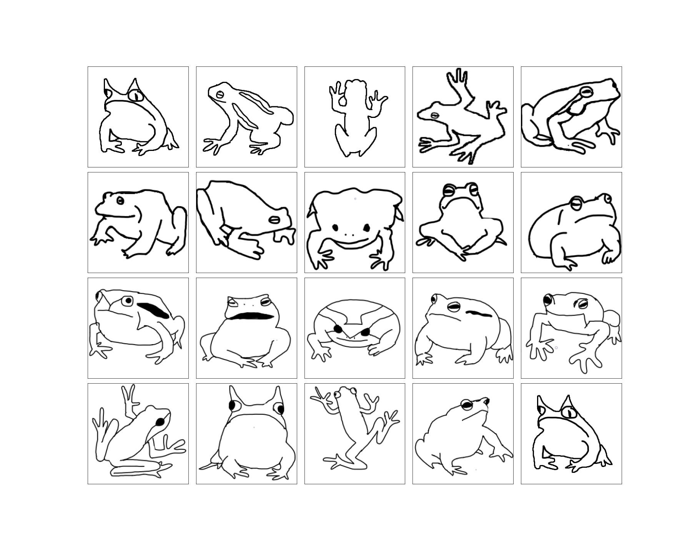
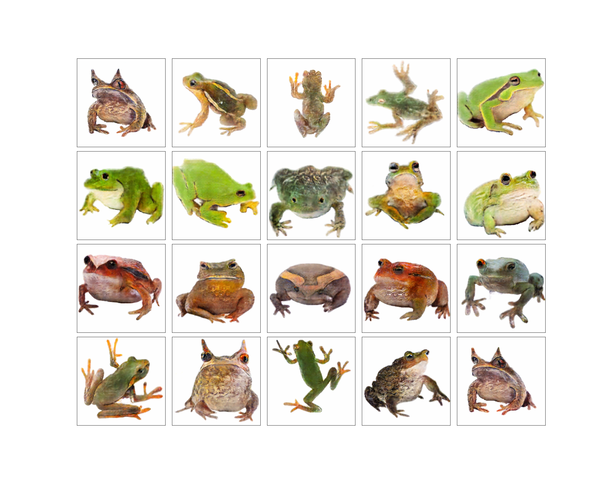

# sketch2frog - Generating Frogs from Simple Sketches

<table align="center" width=100%>
    <tr>
        <td width=50%>
            <a href="https://github.com/yleneb/sketch2frog/blob/master/sketch2frog/reports/figures/hand_drawn_input.png">
                </img>
            </a>
        </td>
        <td width=50%>
            <a href="https://github.com/yleneb/sketch2frog/blob/master/sketch2frog/reports/figures/hand_preds_0.png">
                </img>
            </a>
        </td>
    </tr>
        <td align="center" colspan="2" width=95%>
            <i>Example results on hand drawn frogs. Stripes and markings are meaningfully translated and there is diversity in frog colour.</i>
        </td>
</table>

        <a href='https://github.com/yleneb/sketch2frog/blob/master/sketch2frog/reports/Report.ipynb'>[Learn more]</a>
        

------------

sketch2frog transforms hand drawn sketches to colour images of frogs, imspired by [edges2cats](https://affinelayer.com/pixsrv/) and other [applications](https://phillipi.github.io/pix2pix/#:~:text=#pix2pix). A dataset of sketch-like images is generated using [U2Net](https://github.com/shreyas-bk/U-2-Net) and [DexiNed](https://github.com/xavysp/DexiNed/tree/master/DexiNed-TF2), these frog image-sketch pairs are used to train a pix2pix model.

pix2pix is a Conditional GAN for image-to-image translation with paired datasets. This project contains a build pix2pix in TensorFlow 2 and combines ideas from several implementations, listed in the resources below.

## [Dataset](https://github.com/jonshamir/frog-dataset)

This dataset created by [Jon Shamir](https://github.com/jonshamir) contains 7796 preprocessed 224x224 frog images, mostly on white backgrounds.

## Resources

1. [Image-to-Image Translation with Conditional Adversarial Networks (pix2pix paper)](https://arxiv.org/abs/1611.07004)
2. [pix2pix: Image-to-image translation with a conditional GAN - TensorFlow Tutorials](https://www.tensorflow.org/tutorials/generative/pix2pix)
3. [How to Develop a Pix2Pix GAN for Image-to-Image Translation - Jason Brownlee](https://machinelearningmastery.com/how-to-develop-a-pix2pix-gan-for-image-to-image-translation/)
4. [Modern implementation of a GAN in Keras - François Chollet](https://twitter.com/fchollet/status/1250622989541838848?s=20)
5. [How to Train a GAN? Tips and tricks to make GANs work - Soumith Chintala](https://github.com/soumith/ganhacks)